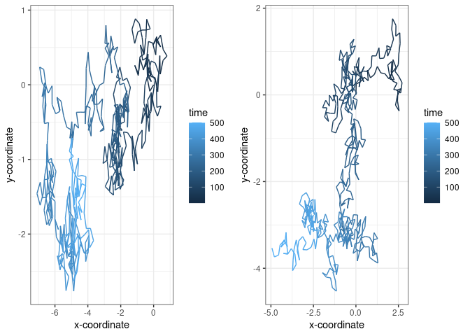
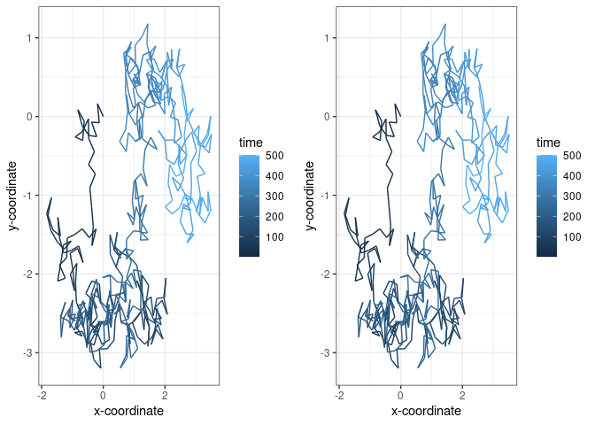
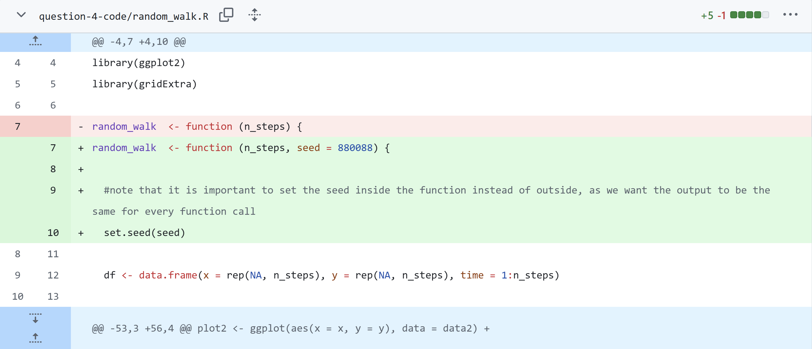
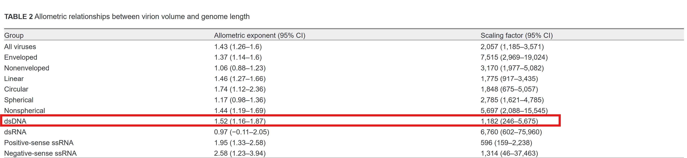
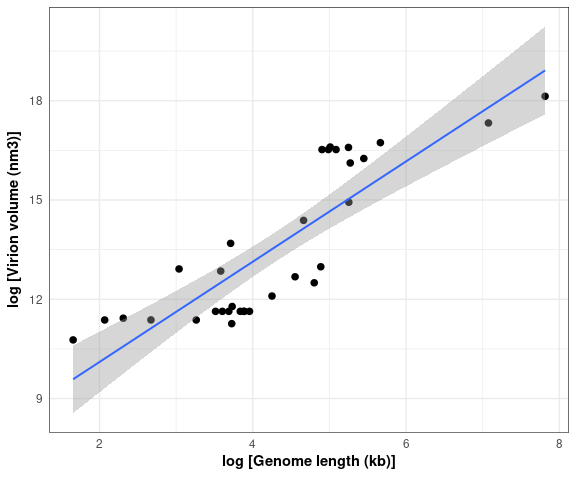

# Reproducible research: version control and R


The fourth and fifth questions are answered in this markdown file
developed using Quarto.

------------------------------------------------------------------------

## Questions 1-3

Questions 1 to 3 are answered in this linked [GitHub
Repository](https://github.com/anonymous88icl/logistic_growth/).

------------------------------------------------------------------------

## Question 4

### a)

#### Figure 1: Result of Executing `random_walk.R`



As we can see, the code produces two graphs that are the result of
random walks. In each of the 500 time-steps, the program generates an
uniformly random angle between $0$ and $2\pi$ and walks in that
direction by 0.25 units. The program records the coordinates at each
time step and eventually outputs the path in a graph. The time is
indicated by the color of the path (gets lighter as time passes). One
interesting thing we observe here is that the two graphs are different
even though they are produced by the same function. Also interestingly,
if we re-run the program, we will also get different results. This is
not ideal if we want reproducible results. (I didn’t make any specific
observations about the paths because that is also generated randomly.)

### b)

A random seed is an initial value used to initialize a random number
generator. Since a computer program is always fixed, it is impossible
for it to generate numbers in a “perfectly random” fashion. You could
always use something like time in a nanosecond-scale, but even then you
can’t guarantee complete randomness. Hence, the general principle to
generate these pseudorandom numbers is to start with an initial seed,
which we can either fix or set as some function of time (to make it more
random). Then, we apply some complex mathematical process with no simple
pattern to generate a sequence of numbers that seam to be random.

Hence, if we fix the seed, the outputs will still be close to random,
but it will be the same every time we re-initialize the random function.
We will now add this change to our code to make our random walk
reproducible.

### c)

We set the random seed to be equal to 880088, and the following output
is produced:

#### Figure 2: Result of Executing `random_walk.R` after fixing random seed



As we can see, the plots the look the same now. It also stays the same
if we re-run the program. This is much better for reproducibility.

### d)

#### Figure 3: The commit which added reproducibility



Note that it is important we set the seed inside of the function instead
of globally, as the latter would only guarentee uniformity between
different runs of the program, but not uniformity between different
calls of the function.

------------------------------------------------------------------------

## Question 5

### a)

From running the following script we see that there are 33 rows and 13
columns of data:

``` r
install.packages("here")
library(here)
virion_data <- read.csv(here("question-5-data","Cui_etal2014.csv"))

str(virion_data)
```

    'data.frame':   33 obs. of  13 variables:
     $ Family                  : chr  "Myoviridae " "" "" "" ...
     $ Genus                   : chr  "P1-like viruses" "P2-like viruses" "Mu-like viruses" "SPO1-like viruses" ...
     $ Type.species            : chr  "Enterobacteria phage P1" "Enterobacteria phage P2" "Enterobacteria phage Mu" "Bacillus phage SPO1" ...
     $ GenBank.accession.no.   : chr  "NC_005856" "NC_001895" "NC_000929" "NC_011421" ...
     $ Envelope                : chr  "No" "No" "No" "No" ...
     $ Virion.type             : chr  "Icosahedral" "Icosahedral" "Icosahedral" "Icosahedral" ...
     $ T                       : chr  "13" "13" "13" "13" ...
     $ Virion.diameter..nm.    : chr  "85" "60" "60" "94" ...
     $ Virion.length..nm.      : int  NA NA NA NA NA NA NA NA NA NA ...
     $ Virion.volume..nm.nm.nm.: int  321392 113040 113040 434672 113040 113040 267947 113040 87077 77912 ...
     $ Molecule                : chr  "Linear" "Linear" "Linear" "Linear" ...
     $ Genome.length..kb.      : num  94.8 33.6 36.7 132.6 48.5 ...
     $ Protein.no.             : int  110 43 55 204 73 78 162 85 32 53 ...

### b)

We know the relationship could be modelled as

$$
V = \alpha{L}^{\beta}
$$

Applying a Log-transformation on both sides, this gives:

$$
\log({V}) = \log({\alpha{L}^{\beta}}) = \log({\alpha}) + \beta{\log({L})}
$$

And hence $\log(V)$ is a linear function of $\log(L)$. The following
code log-transforms the data and becomes additional columns in the
dataset:

``` r
virion_data$log_virion_volume <- log(virion_data$Virion.volume..nm.nm.nm.)
virion_data$log_genome_length_kb <- log(virion_data$Genome.length..kb.)
```

### c)

Now we fit a linear model for $\log(V)$ against $\log(L)$ and output its
summary with the following code:

``` r
linear_model <- lm(virion_data$log_virion_volume ~ virion_data$log_genome_length_kb, data = virion_data)

summary(linear_model)
```


    Call:
    lm(formula = virion_data$log_virion_volume ~ virion_data$log_genome_length_kb, 
        data = virion_data)

    Residuals:
        Min      1Q  Median      3Q     Max 
    -1.8523 -1.2530 -0.1026  1.0739  2.0193 

    Coefficients:
                                     Estimate Std. Error t value Pr(>|t|)    
    (Intercept)                        7.0748     0.7693   9.196 2.28e-10 ***
    virion_data$log_genome_length_kb   1.5152     0.1725   8.784 6.44e-10 ***
    ---
    Signif. codes:  0 '***' 0.001 '**' 0.01 '*' 0.05 '.' 0.1 ' ' 1

    Residual standard error: 1.263 on 31 degrees of freedom
    Multiple R-squared:  0.7134,    Adjusted R-squared:  0.7042 
    F-statistic: 77.16 on 1 and 31 DF,  p-value: 6.438e-10

The model summary tells us that

$$
\beta = 1.5152
$$

and

$$
\log(\alpha) = 7.0748
$$

$$
\alpha = \exp(7.0748) = 1181.807
$$

The p-values obtained for intercept and gradient are
$2.28\cdot{10^{-10}}$ and $6.44\cdot10^{-10}$ respectively, both far
below the threshold of 0.01, and hence are very statiscally significant.

The paper’s estimates for the dsDNA parameters are given in the
following table:

#### Figure 4: the estimated parameters of the paper



As you can see, our results give the exact same values when rounded to 3
and 4 significant digits, respectively.

### d)

The following code gives the intended output: (We set fig-wdith to 6 and
fig-height to 5)

``` r
ggplot(data = virion_data, aes(x=log_genome_length_kb, y=log_virion_volume)) + 
  geom_point(size = 2) +
  labs(x = expression(bold("log [Genome length (kb)]")),
       y = expression(bold("log [Virion volume (nm3)]"))) +
  geom_smooth(method = 'lm', size = 0.7) +
  theme_minimal() +
  theme(panel.border = element_rect(color = "black", fill = NA, linewidth = 0.2))
```



### e)

We will use the formula

$$
V = \alpha{L^{\beta}}
$$ 

With the obtained estimates:

$$
V = 1181.807\cdot{300^{1.5152}} = 6697006
$$ 


Rounding to 3 significant digits gives us

$$
V = 6.70\cdot{10^6} \textit{   }nm^3
$$

# Version Control

The following code helped me record all the versions and so that researchers who want to reproduce the project know the version of programs used:

```r
sink(file = "package-versions.txt")
sessionInfo()
sink()
```

------------------------------------------------------------------------
